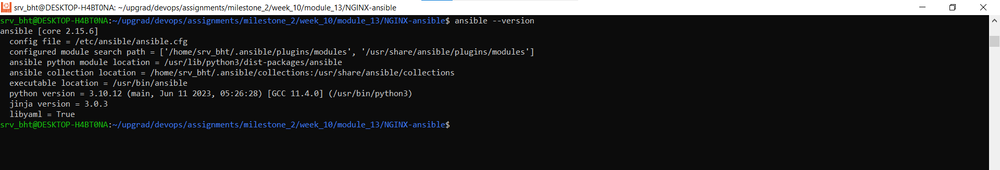
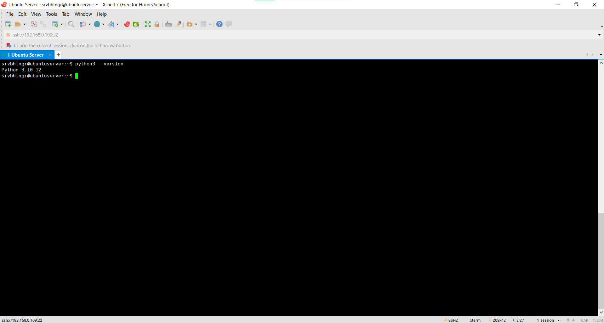
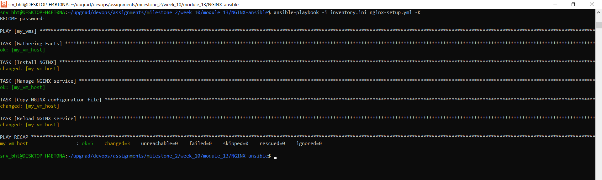
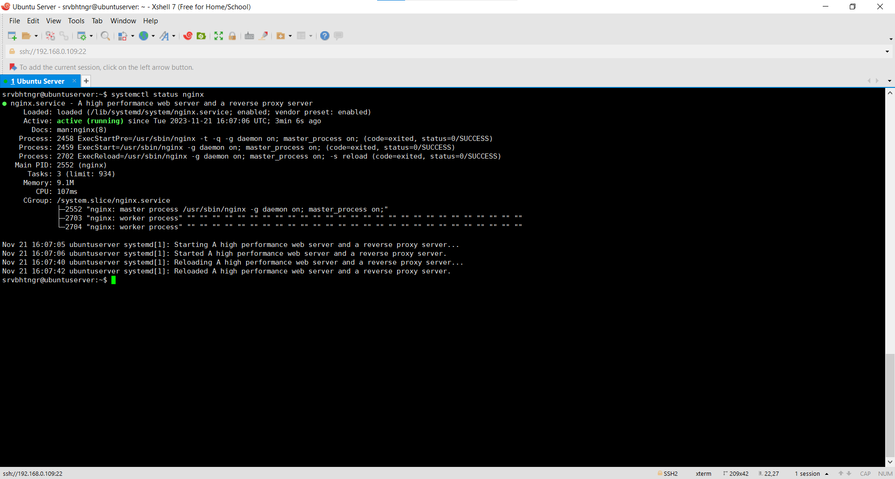
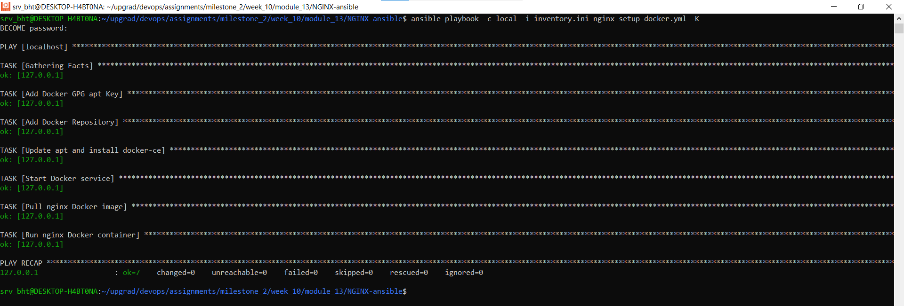
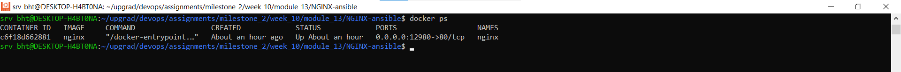
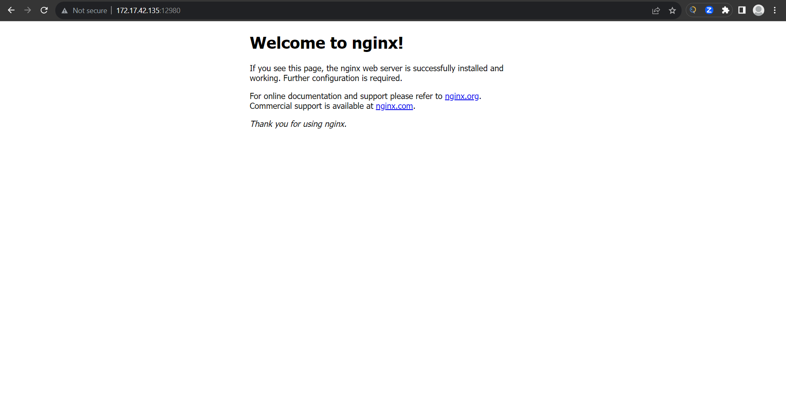

# NGINX-ansible
NGINX Installation and Configuration using Ansible

## Environment Setup

### Ansible version in host


### Python installation in Virtual Machine


### Ansible Playbook Creation
Please find here the playbooks defined for installing and configuring NGINX in VM [here](nginx-setup.yml), and for installing and configuring NGINX in a container [here](nginx-setup-docker.yml).

For the purpose of setting up NGINX in a container we'll be using containerization engine called [docker](https://docs.docker.com/).

### Inventory Definition
In the [inventory file](inventory.ini) we specify the VM host and the localhost since, we'll be installing docker and containerized NGINX server in the local machine itself.
```ini
[my_vms]
my_vm_host ansible_ssh_user=srvbhtngr ansible_ssh_host=192.168.0.109

[localhost]
127.0.0.1
```

### NGINX Configuration
For the purpose of configuring an NGINX server in a remote VM, we'll be templating the [nginx.conf](nginx-config/nginx.conf.j2) directly at the target using Ansible.

Whereas, for the container setup we'll be directly mounting the [nginx.conf file](nginx-config/nginx.conf) using ansible.

### Testing and Validation
To install and configure NGINX server in the remote VM execute the following command
```bash
ansible-playbook -i inventory.ini nginx-setup.yml -K
```
#### Outputs





To install and configure NGINX in a container execute the following command
```bash
ansible-playbook -c local -i inventory.ini nginx-setup-docker.yml -K
```
#### Outputs





